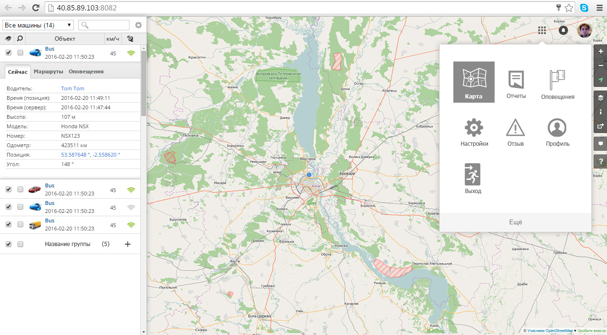

# [Traccar](http://40.85.89.103:8082/?locale=ru)

# Docs Sencha-GXT

* `Basic Tabs` [examples.sencha.com/gxt/4.0.0/examples/explorer-gray.html#ExamplePlace:basictabs](http://examples.sencha.com/gxt/4.0.0/examples/explorer-gray.html#ExamplePlace:basictabs)
* `Row Expander Grid` [examples.sencha.com/gxt/4.0.0/examples/explorer-gray.html#ExamplePlace:rowexpandergrid](http://examples.sencha.com/gxt/4.0.0/examples/explorer-gray.html#ExamplePlace:rowexpandergrid)
* `Using Google maps API with GXT and GWT` [docs.sencha.com/gxt/3.x/apis/GoogleMaps](https://docs.sencha.com/gxt/3.x/apis/GoogleMaps.html)
